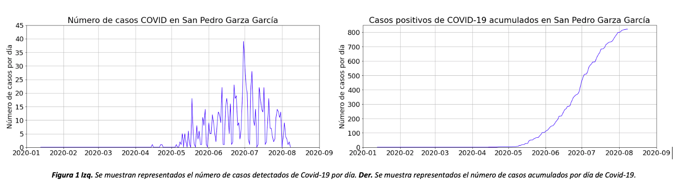
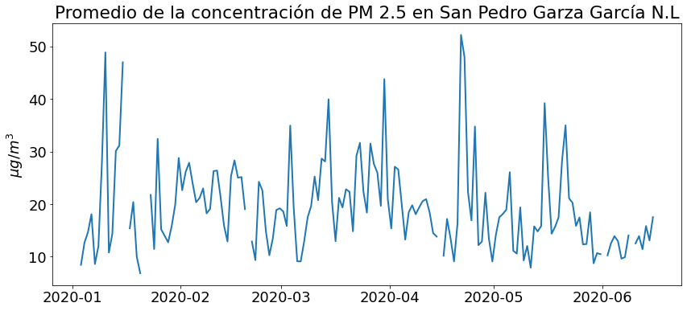
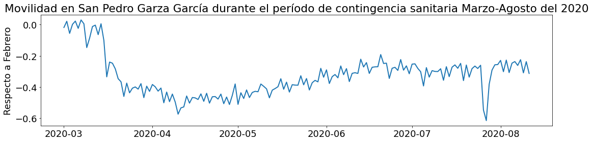
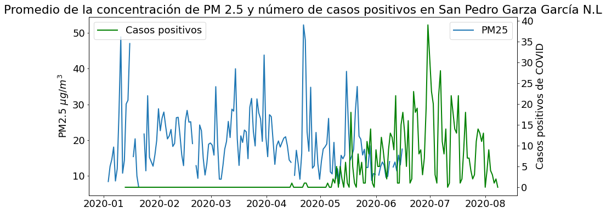
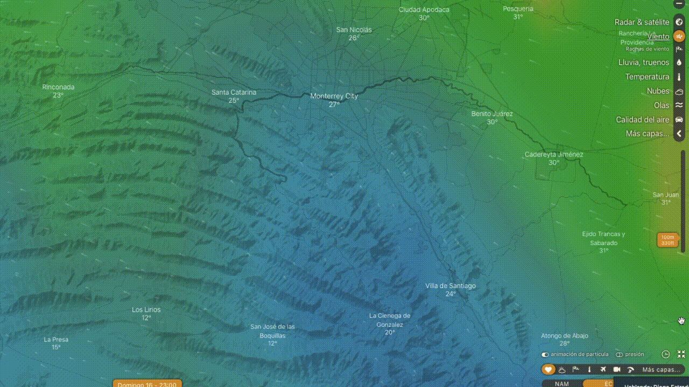

## Impacto del confinamiento social por COVID-19 en la concentración de partículas PM2.5 en el municipio de San Pedro Garza García, Nuevo León, durante el primer semestre del 2020 

### Crisis sanitaria actual y contaminación del aire 

Durante los últimos meses el mundo se ha enfrentado a una severa crisis sanitaria debido al nuevo virus Sars-Cov-2 causante de la enfermedad Covid-19, la cual daña principalmente las vías respiratorias con síntomas parecidos a los de neumonía, además de ser altamente contagiosa. Se han contabilizado más de 21 millones de casos y ya sobrepasan las 700 mil muertes causadas por esta enfermedad. (Tal vez podemos citar esto) Con el propósito de detener los contagios se han aplicado medidas drásticas de confinamiento domiciliario voluntario, reduciendo notoriamente las actividades sociales y económicas. Al disminuir la movilidad en las ciudades, se hizo notar una baja en el uso de los diversos medios de transporte, los cuales representan una de las principales fuentes de contaminación atmosférica.

Hoy en día es muy bien conocido que la contaminación atmosférica causada por las actividades de los humanos tiene efectos negativos en la salud de todos los seres vivos del planeta. En los últimos 20 años, los resultados de las investigaciones han demostrado numerosas características de dicha relación y han sentado las bases que demuestran que, en nuestros días, la contaminación atmosférica continúa siendo un riesgo importante para la salud de la población. Desde marzo de 2020, varias investigaciones han señalado que la progresión de COVID-19 era más importante en las ciudades/áreas/regiones en las que se detectaban ciertos contaminantes atmosféricos a niveles comparativamente altos. (J. L. Domingo et al. 2020) 

Las personas que viven en zonas con altas concentraciones de contaminantes atmosféricos son más propensas a desarrollar afecciones respiratorias crónicas y más sensibles a cualquier agente infeccioso. Por otro lado, una exposición prolongada a la contaminación del aire conduce a un estímulo inflamatorio crónico, incluso en sujetos jóvenes y sanos. (J.L. Domingo et al. 2020) 

### Partículas finas PM 2.5 

Las PM consisten en pequeños residuos líquidos y sólidos de materia orgánica e inorgánica (C, Si, V, Fe, Pb, Cd, Ni, As, y Zn) de menos de 2.5 μm (2.5x10-6 m). El material particulado se genera predominantemente por la combustión de combustibles fósiles, especialmente de vehículos de motor. Las partículas más pequeñas tienden a ser más preocupantes para la salud, ya que son fácilmente respirables, pueden depositarse más profundamente en los pulmones que las partículas más grandes y tienen una mayor relación superficie/volumen, lo que les permite absorber una mayor cantidad de productos químicos en su superficie. (Ciencewicki, J., & Jaspers, I., 2007) En estudios epidemiológicos se han observado asociaciones positivas entre los niveles de PM y la incidencia de la mortalidad, incluidas las relacionadas con las afecciones cardiovasculares y respiratorias 
Aunque no hay una conclusión unánime sobre las fuentes emisoras de la contaminación, la mayoría de los investigadores demuestran que el sector del transporte por carretera es uno de los principales emisores de PM2,5, especialmente en las zonas urbanas de alta densidad (Geelen y otros, 2013; Sawyer, 2010; Wang y otros, 2014) siendo los vehículos de motor la fuente principal de las emisiones de PM2.5 con aproximadamente entre el 20% y el 30% del total.(Hasheminassab et al, 2014; Okuda et al, 2011; Pekey et al, 2013). 
Uno de los resultados de que se haya disminuido el uso de medios de transporte es que también se disminuyó la emisión de gases, producto de la combustión de hidrocarburos. Es por esto que en el presente análisis se busca encontrar el impacto que ha tenido el confinamiento en la contaminación del municipio de San Pedro Garza García, Nuevo León, México. 

### Contexto San Pedro Garza García 

Los primeros casos de Covid-19 se registraron en la ciudad de Wuhan, China en diciembre del 2019 y posteriormente se propagó al resto del mundo. En Nuevo León, México, el día 18 de marzo del 2020, el ayuntamiento de San Pedro Garza García se declaraba en estado de emergencia debido a que al menos 12 de los 14 casos confirmados de COVID-19 en el estado, pertenecían a habitantes de dicho municipio. San Pedro Garza García fue uno de los primeros asentamientos en el país en presentar casos positivos de COVID-19, por lo cual se exhorto de manera inmediata al cese de cualquier evento que promoviera el contacto en multitudes, tanto de índole pública como de privada. El municipio de San Pedro Garza García con sus poco más de 126 mil habitantes, es considerado uno de los municipios más adinerados de Latinoamérica, por lo que se podría traducir a que su población realiza un mayor número de viajes al extranjero, explicando así que los primeros casos de COVID-19 hayan provenido de este lugar llegando a un número de 821 hasta el 8 de agosto del año en curso, de acuerdo con cifras obtenidas del portal “Todo sobre el Covid19” proporcionado por el Gobierno de México.  

### Resultados y discusión

Con la finalidad de conocer la cantidad promedio en la concentración de PM 2.5 del primer semestre del año, se recopilaron datos de la Estación de Monitoreo Ambiental más cercana al municipio de San Pedro G.G, que pertenece al Sistema Nacional de Información de la Calidad del Aire (SINAICA). Las lecturas mostraron altas y bajas concentraciones y de manera especial, en junio se registraron lecturas con concentraciones menores a 20 microgramos por metro cúbico. 

Para conocer la movilidad en la ciudad de San Pedro Garza García, se recurrió a la plataforma Maps de Apple la cual brinda datos de la tendencia en cuanto a movilidad de varias ciudades del mundo. 

 En la Figura 3 se muestra la movilidad de los habitantes de San Pedro Garza García desde el mes de marzo a principios de agosto del 2020. Se tomó como referencia el mes de febrero del mismo año. La movilidad disminuye notablemente durante el mes de abril, hasta cerca de un 60% en comparación al mes de referencia. Para los siguientes meses la movilidad fue baja, entre un 20 y 60 % menos que la que se registró en febrero. 
 
 
 
 Ya que una de las principales fuentes de emisión de PM 2.5 son los automóviles que utilizan combustibles fósiles, y, debido a las medidas tomadas por el gobierno de Nuevo León, específicamente para el municipio de San Pedro Garza García, se esperaba observar una disminución en la cantidad de concentración de PM 2.5 a la par del momento en el que inició el periodo de cuarentena y durante el mismo. Se observó que la movilidad respecto al mes de febrero (antes del inicio de la cuarentena) disminuyó en los meses posteriores, alcanzando uno de sus valores mínimos a mediados de abril, a pesar de esto, los valores en la concentración de PM 2.5 no disminuyeron en gran medida respecto a los meses previos a la cuarentena; aún en el período de contingencia, se observaron cantidades altas de material particulado en el aire de San Pedro, éstas se visualizan en la Figura 4 por los picos altos en abril, mayo y junio, los cuales pueden explicarse por fenómenos atípicos como una serie de incendios que sucedieron en la Sierra de Santiago, en el municipio de Galeana, en Zaragoza y en Mier y Noriega localidades tanto cercanas como alejadas del municipio de San Pedro G. G. (Carrizales, 2020 y Garza, 2020), a pesar de que algunos incendios ocurrieron en áreas remotas, los humos pueden ser arrastrados por las corrientes de viento y  recorrer grandes distancias y en distintas direcciones, por lo observado en la trayectoria predominante del viento en la página de Windy.org es probable que hayan llegado a San Pedro G.G. 
 
 
 
 
 
 En la Figura___  comparan las concentraciones promedio de PM 2.5 en el municipio de San Pedro Garza García del primer semestre de los años 2019 y 2020. En la gráfica se puede observar cómo los valores de PM 2.5 del 2020 se mantienen por encima de los del año anterior, sin embargo, a finales del mes de abril se aprecia un pico considerable de aumento de la concentración de PM2.5, el cual se puede atribuir a los incendios mencionados anteriormente, una vez pasados los incendios, a inicios de mayo se observa cómo hay un decremento en la concentración de PM2.5 con respecto al mismo periodo del año pasado, los cuales también coinciden con las fechas en las que se registró la menor movilidad del semestre, es decir una reducción en la movilidad de hasta 60% en comparación al mes de febrero del 2020. 
 
 ### ¿Baja movilidad social= bajas concentraciones de PM 2.5?
 
 De acuerdo con un estudio realizado por Rodríguez et al (2020), basándose en la recopilación de datos sobre la concentración de las partículas más nocivas para la salud (PM2,5), en las diferentes capitales del mundo, se llevó a cabo un análisis comparativo de la concentración durante un tiempo típico de movilidad normal y durante el cierre. Los patrones de comportamiento muestran como resultado una disminución de su concentración durante la temporada de confinamiento, restaurando favorablemente la calidad del aire de la mayoría de las ciudades analizadas. Con base en lo anterior se esperaba observar el mismo comportamiento para el municipio de San Pedro G. G., ya que este pertenece a la Zona Metropolitana de Monterrey, sin embargo, los resultados obtenidos revelaron altas concentraciones de PM 2.5 aún en la etapa de confinamiento. Como se mencionó anteriormente esto se atribuye a los incendios forestales presentados durante los meses de abril y mayo. En un estudio publicado por la revista académica “Environmental Science & Technology” en el año 2019 en donde se buscaba conocer la contribución de material particulado por parte de los distintos sectores en Canadá, se encontró que los incendios forestales contribuyeron en mayor medida (17%) seguido del sector de transporte (16%) (Jung et al., 2019). 
 
Aunado a lo anterior, esta investigación requiere realizar más estudios, tanto del área medioambiental, como clínica, económica y social, para conocer todos los factores que ocasionaron que las concentraciones de PM 2.5 no se redujeran como en otras ciudades durante el primer semestre del 2020, tiempo en el que se ha presentado confinamiento social debido a la pandemia por COVID-19.  

### La importancia del control de material particulado 2.5 en el aire

Es de vital importancia reconocer el reto al que las ciudades se han enfrentado a lo largo de las últimas décadas en cuanto a la calidad del aire. Por esta razón, es tan importante que la calidad del aire sea monitoreada en las ciudades, esencialmente en las capitales, y en este caso, es más importante monitorear las PM 2.5 debido a los riesgos explicados en la introducción. Por lo tanto, es fundamental que tanto los políticos y los tomadores de decisiones como los investigadores y profesionales del medio ambiente, salud pública y otras áreas que se interrelacionan en cuanto a la calidad del aire. 

Los resultados de esta investigación subrayan la importancia de seguir cumpliendo los reglamentos vigentes sobre contaminación del aire y recalcan se anticipa que el no hacerlo podría potencialmente aumentar el número de muertes y hospitalizaciones a largo plazo por COVID-19. 

Ya que, de acuerdo con un estudio realizado por Xiao Wu, et al., 2020, los resultados indican que la exposición a largo plazo a la contaminación atmosférica aumenta la vulnerabilidad a los resultados más graves de COVID-19. Se comprobó estadísticamente que un aumento de 1 𝜇g/m3 en la exposición a largo plazo a PM2.5 es asociado con un aumento del 8% en la tasa de mortalidad de COVID-19. Así como una mayor carga al sistema de salud con otras muertes y enfermedades relacionadas con el PM2.5, que desviarían recursos de los pacientes de COVID-19. 
